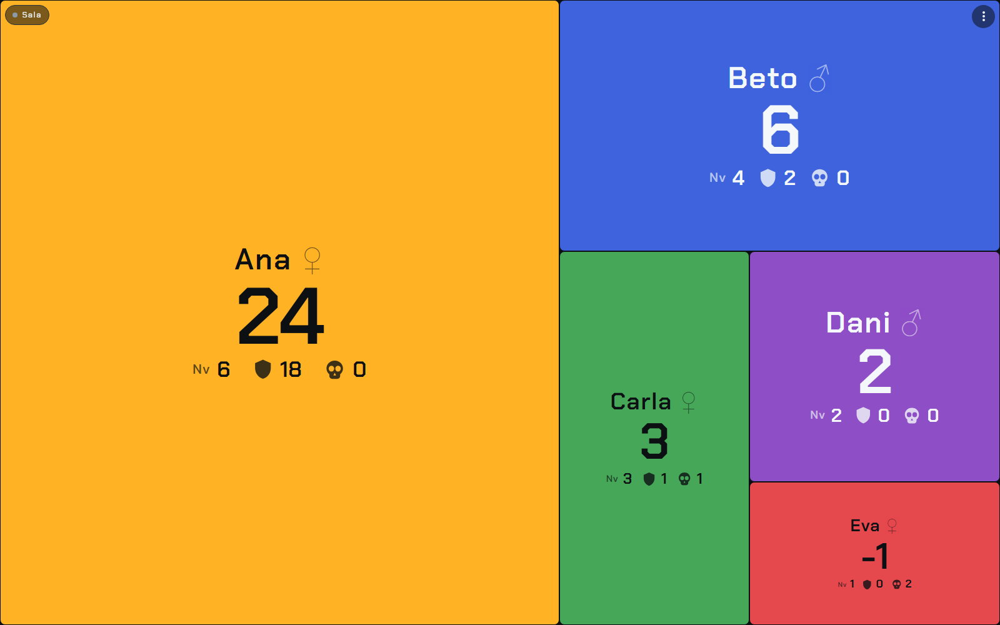

# Munchkin Level Counter

A level and gear counter for Munchkin. Put a tablet in the middle of the table:
the screen is split between the players by their power, so everyone sees who is
winning at a glance. Each player can also run their own character from their
phone.

**[Open the app →](https://munchkin-btb.pages.dev/en/)**

Free, no accounts, no ads, works offline. In English, Spanish, French, German,
Italian and Portuguese.



## How to use it

**On one device:** add the players, choose the level you win at and press
*Start*. No internet needed.

**With phones:**

1. On the tablet in the middle, tap *Create room*.
2. Everyone scans the QR code (or types the 4-letter code) and picks their
   character.
3. Each phone shows its own character with big buttons. The tablet shows
   everyone.

Anyone in the room can add players, remove them or reset the game. Rooms delete
themselves 24 hours after the last change.

## Features

- Level, gear and penalties for each player. Power = level + gear − penalties.
- A board where each player's block is sized by their power.
- Win at level 10, 20 or whatever your group plays.
- Hold − / + to count fast, or type the number.
- Installs as an app. The game is saved on the device.

## Development

```
npm install
npm run dev     # the app, also reachable from phones on your network
npm test
```

### Room server

Rooms run on a Cloudflare Worker with one Durable Object per room. Without it,
the app still works on a single device.

```
npx wrangler login
npm run deploy:sala
```

Then point the app at it in `.env`:

```
VITE_ROOM_URL=https://munchkin-salas.YOUR-SUBDOMAIN.workers.dev
```

Test it locally:

```
npm run dev:sala    # the Worker on port 8787
npm run test:sala   # creates a room, connects two devices, checks they stay in sync
```

### Deploy

```
npm run deploy        # the website (Cloudflare Pages)
npm run deploy:sala   # the room server
```

Deploy the room server only when `worker/` changes: it restarts every room and
drops everyone connected (they reconnect on their own).

## How it works

- `src/game.js` — the game rules. The same file runs on the phones, the table
  and the server.
- `src/territory.js` — splits the screen into blocks (squarified treemap).
- `src/state.js` — React hooks for the game, the device's role and the room.
- `src/room.js` — the room connection: heartbeat and reconnection.
- `worker/index.js` — the room server.

Every change is an action. The server validates it, applies it and sends the
whole game back to every device. Counters move by increments, so two people
pressing + at the same time add two.

## License

[MIT](LICENSE). Munchkin is a trademark of Steve Jackson Games. This is an
unofficial fan-made counter, not affiliated with or endorsed by them.
